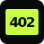

<p align="center">
  
</p>

<h1 align="center">The402Machine</h1>

<p align="center">
  <strong>Insert sats. Receive a tiny piece of the Internet. Watch it disappear.</strong>
</p>

<p align="center">
  <a href="https://the402machine.com">Live machine</a> ·
  <a href="https://the402machine.com/demo.html">Interactive demos</a> ·
  <a href="https://the402machine.com/api.html">API reference</a> ·
  <a href="INSTALL.md">Self-hosting guide</a>
</p>

<p align="center">
  
  
  
  
</p>

---

The402Machine is a source-available vending machine for small, temporary Internet capabilities paid once over Bitcoin Lightning.

No account. No subscription. No credit balance. Every product has a visible lifetime or quota and a defined ending.

## The cartridges

| Product | What it does | What it never does |
| --- | --- | --- |
| **CATCH** | Receives bounded webhook requests in a private inbox with event inspection and deletion controls. | It does not forward traffic, call user URLs or execute code. |
| **WHISPER** | Delivers a client-encrypted handoff immediately or at a scheduled reveal time, with a bounded read allowance. | The server never receives the plaintext or AES key. |
| **PULSE** | Turns authenticated heartbeats into a private dashboard and optional public status page. | It stores no request body, performs no outbound checks and sends no alerts. |

### One simple price ladder

| Plan | Price | Typical role |
| --- | ---: | --- |
| **Spark** | 42 sats | Short tests, handoffs and jobs |
| **Standard** | 402 sats | Useful production-sized temporary work |
| **Long** | 4,002 sats | Longer-running bounded infrastructure |

Each product applies its own lifetime and quota. The live catalogue is the source of truth.

## See it before buying

The [demo area](https://the402machine.com/demo.html) contains local, read-only previews of:

- a CATCH inbox populated with sample events;
- a WHISPER handoff decrypted entirely in the browser;
- a PULSE heartbeat dashboard with interactive status updates.

The demos create no invoice, resource, capability or payment request.

## Design principles

- **Closed functions:** one product, one narrow job.
- **Visible fuses:** duration, quota and destruction policy are shown before payment.
- **Server-confirmed settlement:** wallet callbacks are never treated as proof of payment.
- **Capability-based access:** no customer accounts or recovery workflow.
- **Fail closed:** provisioning, quota consumption and final deletion are transactional.
- **No hidden egress:** products do not become proxies, redirectors or generic compute.

## API first

The browser checkout and owner interfaces sit on the same HTTP API available to scripts and agents.

Read the dedicated [API reference](https://the402machine.com/api.html) for catalogue discovery, HTTP 402 quotes, payment polling and product operations.

## Run your own machine

Installation, configuration, migrations, payment adapter details, security boundaries and release checks live in **[INSTALL.md](INSTALL.md)**.

Quick local start:

```bash
npm ci
npm run dev
```

Then open `http://127.0.0.1:4020`.

## Security

Please report security issues privately rather than opening a public issue. Never include capabilities, payment credentials, wallet material or production connection strings in a report.

## License

All rights reserved while the product and abuse model are being validated.
